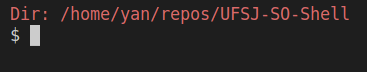

# UFSJ-SO-Shell

Este é um shell personalizado que suporta a execução de comandos internos e externos e oferece recursos como história de comandos, execução de comandos em segundo plano, redirecionamento de entrada e saída, e tubulação. 



## Instalação

Para usar o shell, é preciso instalar a biblioteca readline, que adiciona funcionalidades de histórico. Use o comando para instalar.:
```
sudo apt-get install libreadline-dev  
```

## Como usar

1. Compile o código com o comando:
```
make
```

2. Execute o arquivo gerado com o comando:
```
./shellso commands_file <optional>
```

3. Digite os comandos desejados no prompt. Você pode usar a tecla de seta para cima e para baixo para navegar pela história de comandos.

4. Para executar um comando em segundo plano, adicione o símbolo `&` no final do comando. Por exemplo, `sleep 10 &`.

5. Para redirecionar a entrada ou saída de um comando, use os símbolos `<=` para entrada ou `=>` para saída seguidos do nome do arquivo. Por exemplo, `cat <= input.txt => output.txt`. Observe que apenas o primeiro e o último comando em uma sequência de tubulações podem ter redirecionamento.

6. Para executar uma sequência de comandos em tubulação, separe-os com o símbolo `|`. Por exemplo, `ls -a | wc -l`. 

7. Para sair do shell, digite `fim`.
